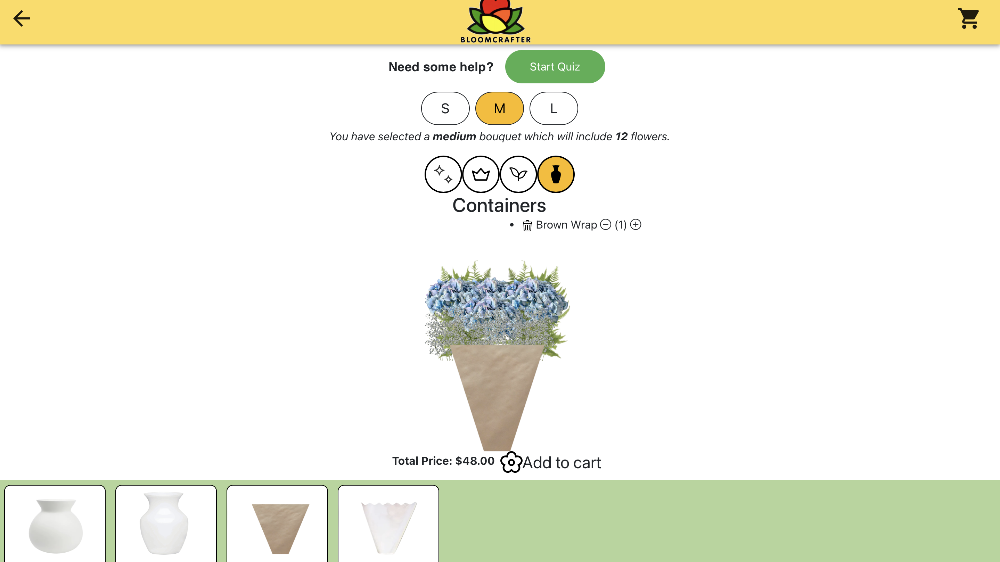

<!-- Improved compatibility of back to top link: See: https://github.com/othneildrew/Best-README-Template/pull/73 -->
<a name="readme-top"></a>
<!--
*** Thanks for checking out the Best-README-Template. If you have a suggestion
*** that would make this better, please fork the repo and create a pull request
*** or simply open an issue with the tag "enhancement".
*** Don't forget to give the project a star!
*** Thanks again! Now go create something AMAZING! :D
-->


<!-- PROJECT SHIELDS -->
<!--
*** I'm using markdown "reference style" links for readability.
*** Reference links are enclosed in brackets [ ] instead of parentheses ( ).
*** See the bottom of this document for the declaration of the reference variables
*** for contributors-url, forks-url, etc. This is an optional, concise syntax you may use.
*** https://www.markdownguide.org/basic-syntax/#reference-style-links


<!-- PROJECT LOGO -->
<br />
<div align="center">
    <a href="https://github.com/394-w24/BloomCraft2/blob/main/public/icons/logo.png">
    
  </a>
  <h3 align="center">Bloomcrafter</h3>

  <p align="center">
    Bring your floral visions to life with our interactive bouquet builder!
    <br />
    <a href="https://github.com/394-w24/BloomCraft2"><strong>Explore the docs »</strong></a>
    <br />
    <br />
    <a href="https://bloomcrafter-fbd57.web.app/">Deployed Website</a>
    </p>
</div>


<!-- TABLE OF CONTENTS -->
<details>
  <summary>Table of Contents</summary>
  <ol>
    <li>
      <a href="#about-the-project">About The Project</a>
      <ul>
        <li><a href="#built-with">Built With</a></li>
      </ul>
    </li>
    <li>
      <a href="#getting-started">Getting Started</a>
      <ul>
        <li><a href="#prerequisites">Prerequisites</a></li>
        <li><a href="#installation">Installation</a></li>
        <li><a href="#deploying-to-firebase">Deploying to Firebase</a></li>
        <li><a href="#running-the-app">Running the App</a></li>       
      </ul>
    </li>
    <li><a href="#usage">Usage</a></li>
    <li><a href="#roadmap">Roadmap</a></li>
    <li><a href="#contributing">Contributing</a></li>
    <li><a href="#license">License</a></li>
    <li><a href="#acknowledgments">Acknowledgments</a></li>
  </ol>
</details>


<!-- ABOUT THE PROJECT -->
## About The Project

[](https://github.com/394-w24/BloomCraft2/blob/main/screenshot.png)

Bloomcrafter is a mobile application designed to empower users to create personalized floral arrangements and bouquets effortlessly. Whether you're planning a special event, expressing gratitude, or simply want to add a touch of nature to your space, Bloomcrafter offers a seamless and intuitive platform to unleash your creativity and bring your floral visions to life!

<p align="right">(<a href="#readme-top">back to top</a>)</p>


### Built With
This section lists the major frameworks/libraries used in the project.

* [![React][React.js]][React-url] - A front-end framework for building responsive websites.
* [![Bootstrap][Bootstrap.com]][Bootstrap-url] - A JavaScript library for building user interfaces.
* [![Firebase][firebase.com]][Firebase-url] - A platform developed by Google for creating mobile and web applications. It provides various services such as Firestore (real-time database), Authentication, Cloud Functions, Hosting, and more, to help developers build high-quality apps.


<!-- GETTING STARTED -->
## Getting Started

Welcome to BloomCrafter! This guide will help you set up and run the project on your local machine.

### Prerequisites

Before you begin, make sure you have the following installed:

- npm (Node package manager)
  ```sh
  npm install npm@latest -g
  ```
- Git (to clone the project repository)

### Installation

1. Clone the BloomCraft2 repository to your local machine:
   ```sh
   git clone https://github.com/394-w24/BloomCraft2.git

2. Navigate to the project directory:
   ```sh
   cd BloomCraft2
3. Install the project dependencies:
   ```sh
   npm install
   
### Deploying to Firebase
This project was originally deployed to Firebase. If you would like to use Firebase as well, [please refer to this comprehensive guide on setting up Firebase](https://courses.cs.northwestern.edu/394/guides/firebase-notes.php).

You will probably want to use Firebase hosting services. If you wish to expand this project and include ways to add to the database within the app, you should initialize a firebase database. We recommend Realtime DB because the data is stored as a json.

As you will see, most of the static data (flower images, flower details) is stored locally. Images are found in public/ and all the flower data is currently stored as a .json under “dummyData.js” under src/components. It’s important to note that the functions rendering these images rely on the local path of the flower and “photoName” field in the flower data (i.e. it will do ). You would need to consider and adjust this if you plan on implementing some online storage service and/or database.

### Running the App

To run the app, you can use the following scripts:

| Script         | Description                                         |
| -------------- | --------------------------------------------------- |
| npm start      | Runs the app in the development mode.               |
| npm run dev    | Alias for `npm start`.                              |
| npm run build  | Builds the app for production to the `dist` folder. |
| npm run serve  | Serves the production build from the `dist` folder. |
| npm test       | Starts a Jest-like test loop.                       |


<!-- USAGE -->
### Usage

To use the BloomCraft2 app, follow these steps:

1. **Build Your Bouquet**:
   - Click on the "Build Your Bouquet" button to navigate directly to the bouquet builder page
   - On the bouquet builder page, you can select different flowers and arrange them to create your personalized bouquet.
   -  Click on the desired focal, filler, foliage flowers to add it to your bouquet.

or take our quiz, to get a custom template to start with:
[](https://github.com/394-w24/BloomCraft2/blob/main/public/icons/quiz.png)

2. **Customize the size**:
   - Toggle between the small, medium, and large sizes buttons.
[](https://github.com/394-w24/BloomCraft2/blob/main/public/icons/focal_filler.png)

3. **View Your Cart**:
   - Click on the shopping cart icon to view your current bouquet selections.
   - You can add or remove flowers from your cart as needed.  

4. **Generate a Note**:
   - After finalizing your bouquet, you can generate a note to accompany your bouquet.
   - Have fun creating beautiful and personalized bouquets for any occasion!
   [](https://github.com/394-w24/BloomCraft2/blob/main/public/icons/note.png)

<!-- ROADMAP -->
## Roadmap
Include payment API 
Develop florist profiles to sell products
Allow Florist to add flowers to database
Allow Florist to receive online orders from the buyers

### Known Issues:

- Users can select more than one container in the BouquetBuilder page.
- Filter applied by taking the quiz cannot be removed without reloading the page

<p align="right">(<a href="#readme-top">back to top</a>)</p>


<!-- CONTRIBUTING -->
## Contributing

Contributions are what make the open source community such an amazing place to learn, inspire, and create. Any contributions you make are **greatly appreciated**.

If you have a suggestion that would make this better, please fork the repo and create a pull request. You can also simply open an issue with the tag "enhancement".
Don't forget to give the project a star! Thanks again!

1. Fork the Project
2. Create your Feature Branch (`git checkout -b feature/AmazingFeature`)
3. Commit your Changes (`git commit -m 'Add some AmazingFeature'`)
4. Push to the Branch (`git push origin feature/AmazingFeature`)
5. Open a Pull Request

<p align="right">(<a href="#readme-top">back to top</a>)</p>


<!-- LICENSE -->
## License

Distributed under the MIT License. See `LICENSE.txt` for more information.
<br />
<br />
<!-- ACKNOWLEDGMENTS -->
## Acknowledgments

* Christopher K. Riesbeck 
* Roxanne Capron
* Patrycja Delcourt

<p align="right">(<a href="#readme-top">back to top</a>)</p>

<!-- MARKDOWN LINKS & IMAGES -->
[React.js]: https://img.shields.io/badge/React-20232A?style=for-the-badge&logo=react&logoColor=61DAFB
[React-url]: https://reactjs.org/
[Bootstrap.com]: https://img.shields.io/badge/Bootstrap-563D7C?style=for-the-badge&logo=bootstrap&logoColor=white
[Bootstrap-url]: https://getbootstrap.com
[Firebase.com]: https://img.shields.io/badge/firebase-a08021?style=for-the-badge&logo=firebase&logoColor=ffcd34
[Firebase-url]: https://firebase.google.com/

